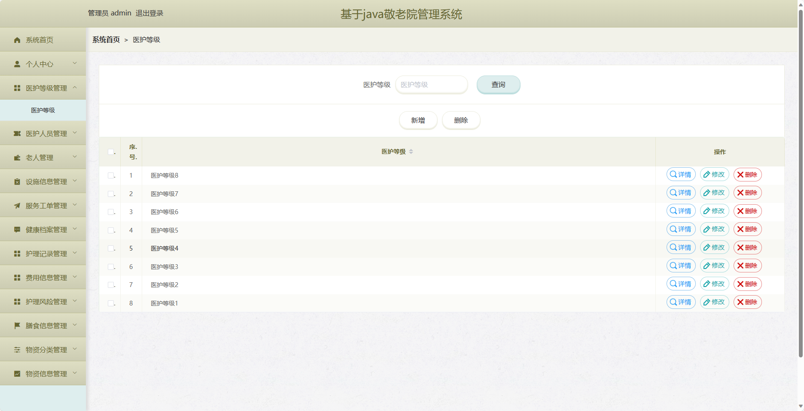
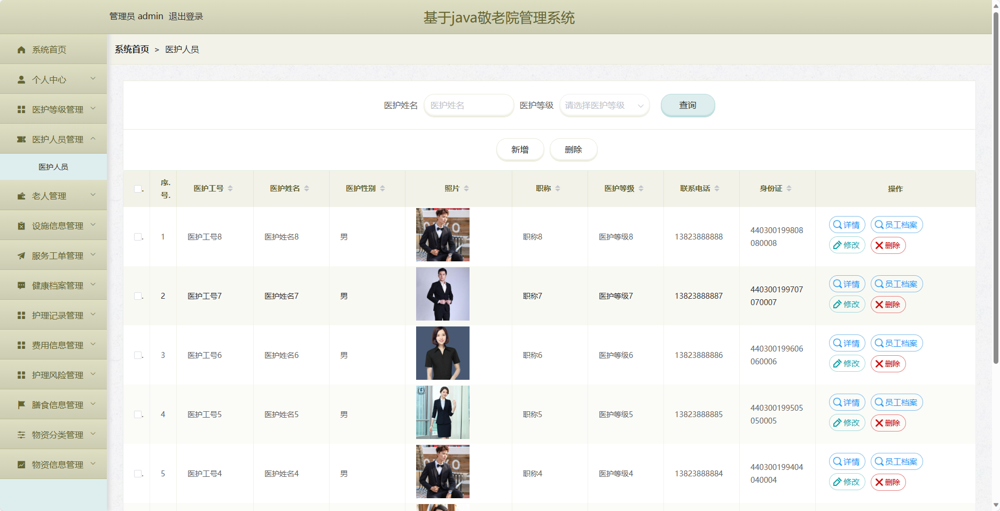
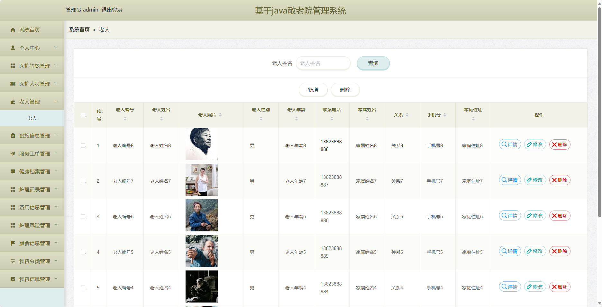
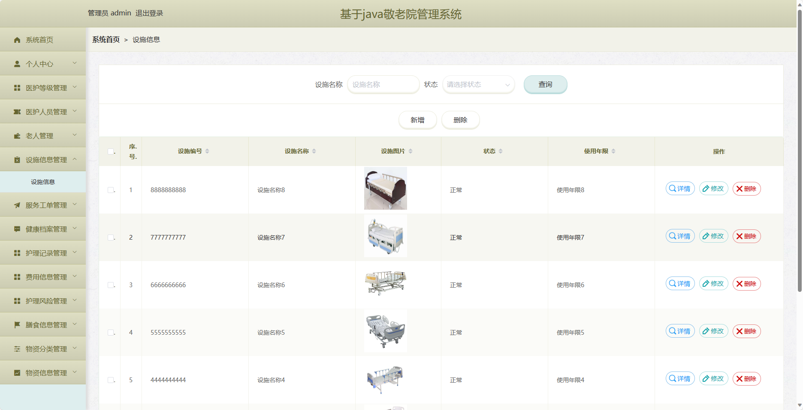
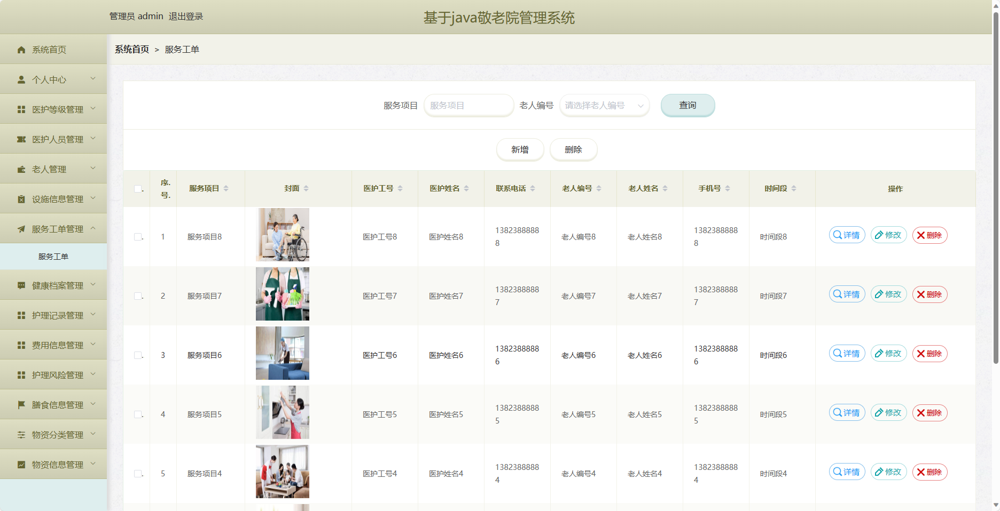
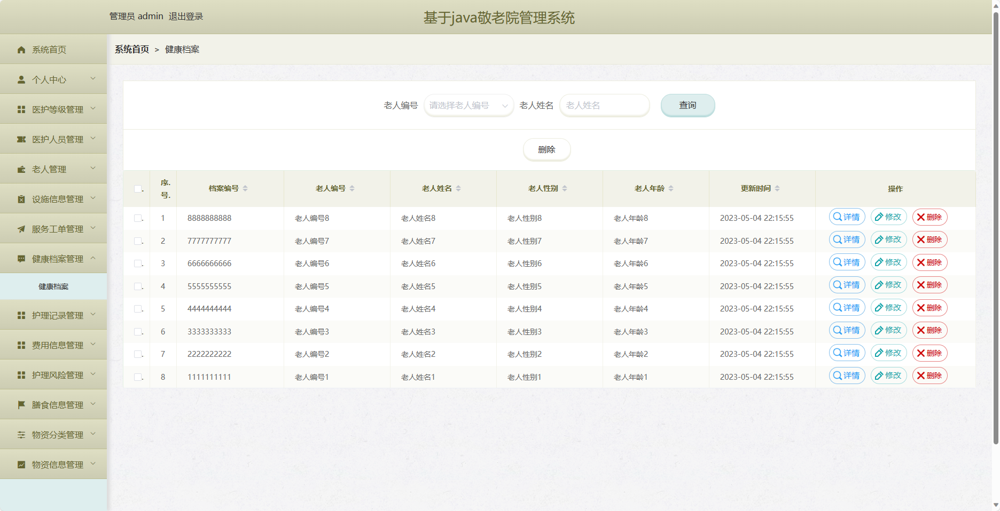
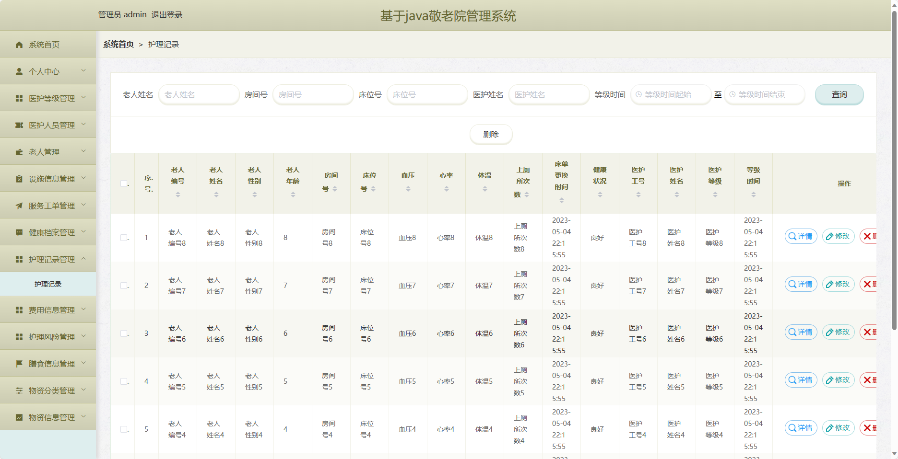
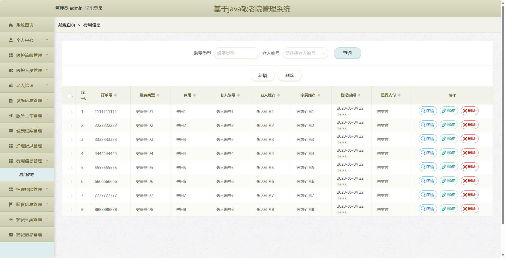
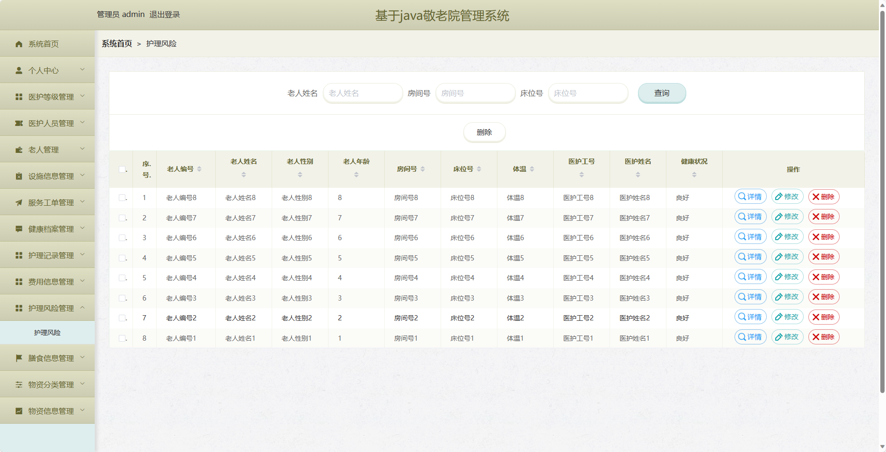

基于SpringBoot的敬老院管理系统
=
- 完整代码获取地址：从戎源码网 ([https://armycodes.com/](https://armycodes.com/))
- 作者微信：19941326836  QQ：952045282 
- 承接计算机毕业设计、Java毕业设计、Python毕业设计、深度学习、机器学习
- 选题+开题报告+任务书+程序定制+安装调试+论文+答辩ppt 一条龙服务
- 所有选题地址https://github.com/nature924/allProject

一、项目介绍
---
基于Spring Boot框架实现的敬老院管理系统，系统包含三种角色：管理员、老人、医护人员，主要功能如下。

### 老人：
1. 个人中心：老人可以管理个人信息，包括修改密码等操作。
2. 服务工单管理：老人可以查看自己的服务工单信息，包括服务内容、服务时间、服务人员等。
3. 健康档案管理：老人可以管理自己的健康档案信息，包括个人病史、用药记录等。
4. 护理记录管理：老人可以查看自己的护理记录信息，包括护理时间、护理内容、护理人员等。
5. 费用信息管理：老人可以查看自己的费用信息，包括护理费用、膳食费用等。
6. 护理风险管理：老人可以查看自己的护理风险信息，包括身体状况、护理方案等。
7. 膳食信息管理：老人可以查看自己的膳食信息，包括饮食习惯、饮食要求等。

### 医护人员：
1. 个人中心：医护人员可以管理个人信息，包括修改密码等操作。
2. 老人管理：医护人员可以管理老人信息，包括添加、编辑、删除等操作。
3. 设施信息管理：医护人员可以管理设施信息，包括添加、编辑、删除等操作。
4. 服务工单管理：医护人员可以管理服务工单信息，包括添加、编辑、删除等操作。
5. 健康档案管理：医护人员可以管理老人的健康档案信息，包括添加、编辑、删除等操作。
6. 护理记录管理：医护人员可以管理老人的护理记录信息，包括添加、编辑、删除等操作。
7. 护理风险管理：医护人员可以管理老人的护理风险信息，包括添加、编辑、删除等操作。
8. 物资信息管理：医护人员可以管理物资信息，包括添加、编辑、删除等操作。
9. 物资出库管理：医护人员可以管理物资的出库信息，包括添加、编辑、删除等操作。
10. 物资入库管理：医护人员可以管理物资的入库信息，包括添加、编辑、删除等操作。
11. 来访登记管理：医护人员可以管理老人的来访登记信息，包括添加、编辑、删除等操作。
12. 家属探望管理：医护人员可以管理老人的家属探望信息，包括添加、编辑、删除等操作。
13. 请假申请管理：医护人员可以管理请假申请信息，包括添加、编辑、删除等操作。

### 管理员：
1. 个人中心：管理员可以管理个人信息，包括修改密码等操作。
2. 医护等级管理：管理员可以管理医护人员的等级信息，包括添加、编辑、删除等操作。
3. 医护人员管理：管理员可以管理医护人员的信息，包括添加、编辑、删除等操作。
4. 老人管理：管理员可以管理老人的信息，包括添加、编辑、删除等操作。
5. 设施信息管理：管理员可以管理设施信息，包括添加、编辑、删除等操作。
6. 服务工单管理：管理员可以管理服务工单信息，包括添加、编辑、删除等操作。
7. 健康档案管理：管理员可以管理老人的健康档案信息，包括添加、编辑、删除等操作。
8. 护理记录管理：管理员可以管理老人的护理记录信息，包括添加、编辑、删除等操作。
9. 费用信息管理：管理员可以管理费用信息，包括添加、编辑、删除等操作。
10. 护理风险管理：管理员可以管理护理风险信息，包括添加、编辑、删除等操作。
11. 膳食信息管理：管理员可以管理膳食信息，包括添加、编辑、删除等操作。
12. 物资分类管理：管理员可以管理物资的分类信息，包括添加、编辑、删除等操作。
13. 物资信息管理：管理员可以管理物资的信息，包括添加、编辑、删除等操作。

二、项目技术
---
- 编程语言：Java
- 数据库：MySQL
- 项目管理工具：Maven
- 前端技术：VUE、HTML、Jquery、Bootstrap
- 后端技术：Spring、SpringMVC、MyBatis

三、运行环境
---
- 操作系统：Windows、macOS都可以
- JDK版本：JDK1.8以上都可以
- 开发工具：IDEA、Ecplise、Myecplise都可以
- 数据库: MySQL5.7以上都可以
- Tomcat：任意版本都可以
- Maven：任意版本都可以

四、运行截图
---

### 程序截图：

